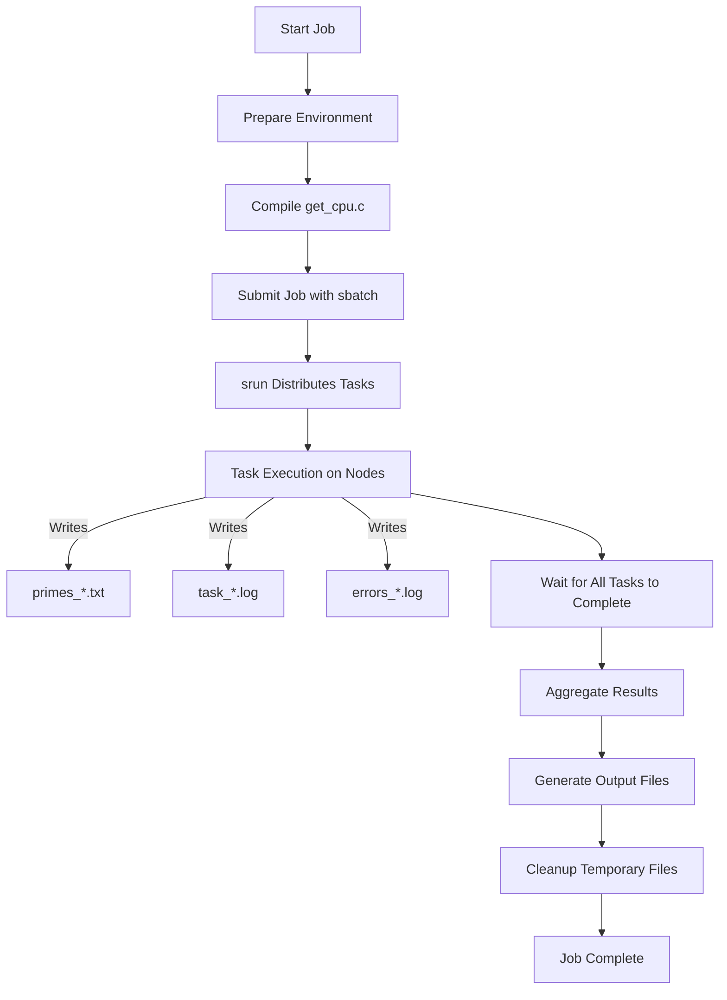
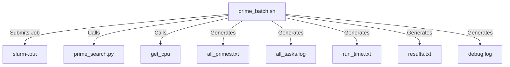

# Prime Number Calculation Using Slurm Cluster

Author: Noel Ashford

## Overview

This project performs parallel computation to find all prime numbers within a specified range using a Slurm cluster. The computation is distributed across multiple nodes and cores to efficiently utilize available resources.

## Contents

- `prime_batch.sh`: Slurm job script to distribute and manage tasks.
- `prime_search.py`: Python script to find prime numbers in a given range.
- `get_cpu.c`: C program to identify the exact CPU core a task is running on.
- `get_cpu`: Compiled executable from `get_cpu.c`.
- `README.md`: Documentation and instructions for the project.

## File Structure

```plaintext
find_primes/
├── prime_batch.sh
├── prime_search.py
├── get_cpu.c
├── get_cpu          # Compiled from get_cpu.c
└── README.md
```

## Workflow Diagram



## Getting Started

### 1. Prepare the Environment

Ensure that you have access to a Slurm cluster with the necessary resources.

### 2. Compile `get_cpu.c`

Compile the `get_cpu.c` program to obtain the `get_cpu` executable.

```bash
gcc -o get_cpu get_cpu.c
```

Ensure that the `get_cpu` executable is in the same directory as `prime_batch.sh` and is accessible by all nodes.

### 3. Submit the Job

Submit the Slurm job script using `sbatch`.

```bash
sbatch prime_batch.sh
```

### 4. Monitor the Job

Use `squeue` to monitor the job status.

```bash
squeue -u \$USER
or
squeue -j <job-id>
```

### 5. Outputs Generated

After the job completes, the following output files will be generated:

- `all_primes.txt`: Contains all the prime numbers found in the specified range, in order.
- `all_tasks.log`: Aggregated log file with details of each task, including node, core, range, and duration.
- `run_time.txt`: Total run time of the job.
- `results.txt`: Total number of primes found within the specified range.
- `debug.log`: Debug information and summary of the job.

### 6. Cleanup

Temporary files are automatically cleaned up after the job completes, including:

- `task_*.log`
- `primes_*.txt`
- `errors_*.log`

## Detailed Explanation

### `prime_batch.sh`

This is the main Slurm job script that:

- Sets up the Slurm job parameters.
- Divides the specified range into chunks for each task.
- Uses `srun` to distribute tasks across nodes and cores.
- Records the start and end times to calculate the total run time.
- Aggregates results and cleans up temporary files.

#### Slurm Job Parameters

```bash
#SBATCH --partition=Tunninet         # Partition to run on
#SBATCH --job-name=prime_calc        # Job name
#SBATCH --nodes=4                    # Number of nodes
#SBATCH --ntasks=64                  # Total tasks (16 tasks per node)
#SBATCH --ntasks-per-node=16         # Tasks per node
#SBATCH --cpus-per-task=1            # CPUs per task
#SBATCH --output=slurm-%j.out        # Standard output
#SBATCH --time=00:20:00              # Max time
```

#### Workflow

1. **Initialize Variables**: Sets the range (`START`, `END`) and calculates `CHUNK_SIZE` and `REMAINDER`.
2. **Export Variables**: Makes variables available to `srun` tasks.
3. **Distribute Tasks**: Uses `srun` to run tasks across nodes and cores.
4. **Task Execution**: Each task runs `prime_search.py` for its assigned range.
5. **Aggregate Results**: Collects all primes and logs into `all_primes.txt` and `all_tasks.log`.
6. **Calculate Total Run Time**: Records and calculates the total execution time.
7. **Cleanup**: Removes temporary files.

#### Script Content

```bash
#!/bin/bash
#SBATCH --partition=Tunninet         # Partition to run on
#SBATCH --job-name=prime_calc        # Job name
#SBATCH --nodes=4                    # Number of nodes
#SBATCH --ntasks=64                  # Total tasks (16 tasks per node)
#SBATCH --ntasks-per-node=16         # Tasks per node
#SBATCH --cpus-per-task=1            # CPUs per task
#SBATCH --output=slurm-%j.out        # Standard output
#SBATCH --time=00:20:00              # Max time

# Go to the submit directory
cd \$SLURM_SUBMIT_DIR

# Load necessary modules or set up the environment
# module load python/3.8.5  # Uncomment and adjust if using modules

# Ensure 'get_cpu' is executable
chmod +x get_cpu

# Record the start time
job_start_time=\$(date +%s)

# Define the range of numbers
START=1
END=100000
CHUNK_SIZE=\$(( (END - START + 1) / SLURM_NTASKS ))
REMAINDER=\$(( (END - START + 1) % SLURM_NTASKS ))

echo "START=\$START, END=\$END, SLURM_NTASKS=\$SLURM_NTASKS, CHUNK_SIZE=\$CHUNK_SIZE, REMAINDER=\$REMAINDER" > debug.log

# Export variables for srun
export START END CHUNK_SIZE REMAINDER

# Run tasks using srun; Slurm will distribute tasks across nodes and cores
srun --cpu-bind=cores bash -c '
  start_time=\$(date +%s)
  node=\$(hostname)
  core=\$(./get_cpu)
  TASK_ID=\$SLURM_PROCID
  TASK_START=\$((START + TASK_ID * CHUNK_SIZE))
  TASK_END=\$((TASK_START + CHUNK_SIZE - 1))
  if [ \$TASK_ID -eq \$((SLURM_NTASKS - 1)) ]; then
    TASK_END=\$((TASK_END + REMAINDER))
  fi
  {
    echo Node: \$node
    echo Core: \$core
    echo Range: \$TASK_START to \$TASK_END
    python3 prime_search.py \$TASK_START \$TASK_END 2> errors_\${TASK_START}_\${TASK_END}.log
    end_time=\$(date +%s)
    duration=\$((end_time - start_time))
    echo Duration: \$duration seconds
  } > task_\${TASK_START}_\${TASK_END}.log
'

# Record the end time
job_end_time=\$(date +%s)

# Calculate total run time
job_duration=\$((job_end_time - job_start_time))

# Convert duration to HH:MM:SS format
hours=\$((job_duration / 3600))
minutes=\$(( (job_duration % 3600) / 60 ))
seconds=\$((job_duration % 60))

# Output total run time to run_time.txt
printf "Total run time: %02d:%02d:%02d (HH:MM:SS)\n" \$hours \$minutes \$seconds > run_time.txt

# Aggregate task logs in order
{
  for file in \$(ls task_* | sort -t_ -k2 -n); do
    cat "\$file"
  done
} > all_tasks.log

# Merge prime results in order
{
  for file in \$(ls primes_* | sort -t_ -k2 -n); do
    cat "\$file"
  done
} > all_primes.txt

# Count the total number of primes found
total_primes=\$(wc -l < all_primes.txt)

# Output the total number of primes to results.txt
echo "Total number of primes found between \$START and \$END: \$total_primes" > results.txt

# Optionally, add the total number of primes to debug.log
echo "Total number of primes found: \$total_primes" >> debug.log

echo "Prime number search completed. Results in all_primes.txt. Task mapping in all_tasks.log" >> debug.log

# Cleanup temporary files
rm -f task_*.log primes_*.txt errors_*.log
```

### `prime_search.py`

A Python script that:

- Checks if numbers in a given range are prime.
- Writes the prime numbers to a file named `primes_{start}_{end}.txt`.

#### Usage

```bash
python3 prime_search.py <start> <end>
```

#### Script Content

```python
import sys
import math

def is_prime(num):
    """Check if a number is prime."""
    if num <= 1:
        return False
    if num <= 3:
        return True
    if num % 2 == 0 or num % 3 == 0:
        return False
    i = 5
    while i * i <= num:
        if num % i == 0 or num % (i + 2) == 0:
            return False
        i += 6
    return True

def find_primes(start, end):
    """Find all prime numbers in the given range."""
    primes = []
    for num in range(start, end + 1):
        if is_prime(num):
            primes.append(num)
    return primes

if __name__ == "__main__":
    if len(sys.argv) != 3:
        print("Usage: python prime_search.py <start> <end>")
        sys.exit(1)

    start = int(sys.argv[1])
    end = int(sys.argv[2])

    primes = find_primes(start, end)

    # Write primes to file
    output_file = f"primes_{start}_{end}.txt"
    with open(output_file, "w") as f:
        for prime in primes:
            f.write(f"{prime}\n")
```

### `get_cpu.c`

A C program that:

- Uses `sched_getcpu()` to determine the exact CPU core a task is running on.
- Outputs the CPU core number.

#### Compilation

```bash
gcc -o get_cpu get_cpu.c
```

#### Script Content

```c
#define _GNU_SOURCE
#include <stdio.h>
#include <unistd.h>
#include <sched.h>

int main() {
    int cpu = sched_getcpu();
    printf("%d\n", cpu);
    return 0;
}
```

## Output Files

- `all_primes.txt`: All primes in the specified range, in order.
- `all_tasks.log`: Log of each task with node, core, range, and duration.
- `run_time.txt`: Total execution time in HH:MM:SS format.
- `results.txt`: Total number of primes found within the specified range.
- `debug.log`: Debugging information and job summary.

## File Structure Diagram



## Cleaning Up After a Run

Temporary files are cleaned up automatically. If you need to manually clean up or if temporary files remain, you can remove them using:

```bash
rm -f task_*.log primes_*.txt errors_*.log
```

## Adjusting Parameters

You can adjust the range and other parameters in `prime_batch.sh`:

- **Range**: Modify `START` and `END` variables.

  ```bash
  # Define the range of numbers
  START=1
  END=200000  # Changed from 100000 to 200000
  ```

- **Nodes and Tasks**: Adjust `#SBATCH` directives to allocate different resources.

  ```bash
  #SBATCH --nodes=2                    # Number of nodes
  #SBATCH --ntasks=32                  # Total tasks (16 tasks per node)
  ```

## Troubleshooting

- **Python Availability**: Ensure `python3` is available on all nodes.

  ```bash
  python3 --version
  ```

- **Permissions**: Ensure scripts and executables have execute permissions.

  ```bash
  chmod +x prime_batch.sh
  chmod +x get_cpu
  chmod +x prime_search.py
  ```

- **Shared Filesystem**: Make sure all nodes have access to the working directory.

## Contributing

Feel free to contribute by submitting issues or pull requests.

## License

This project is licensed under the MIT License.

---